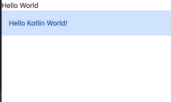

# 02-bootstrap

Kotlin/JS を使うとしても、CSS フレームワークは使いたい。
そんな場合にはいくつか候補がありますが、僕個人は twitter bootstrap に慣れているので、bootstrap を使うことを例として解説します。

## インストール

`build.gradle.kts` に以下のように追記します。

```kotlin
kotlin {
    js {
        browser {
            commonWebpackConfig {
                cssSupport {
                    enabled.set(true)
                }
            }
            binaries.executable()
        }
    }
    sourceSets {
        val jsMain by getting {
            dependencies {
                implementation(npm("bootstrap", "5.1.0"))
            }
        }
    }
}
```

npm モジュールのインストールも簡単にできるのが kotlin/JS の良いところですね。

bootstrap の CSS の読み込みは以下のようにします。

```kotlin
import kotlinx.browser.document

@JsModule("bootstrap/dist/css/bootstrap.min.css")
@JsNonModule
external val bootstrapCss: dynamic

fun main() {
    bootstrapCss // ここで一回呼ぶ必要あり

    val div = document.createElement("div")
    div.className = "alert alert-primary"
    div.textContent = "Hello Kotlin World!"

    document.getElementById("root")?.appendChild(div)
}
```

以下のような画面表示となり、bootstrap の CSS が適用されていることがわかります。



このほかに、`webpack.config.d` に設定をかいて、webpack のレイヤーで処理する方法もあります。
[fritz2-tailwind-template](https://github.com/jwstegemann/fritz2-tailwind-template/tree/main) のやり方が参考になるでしょう。
